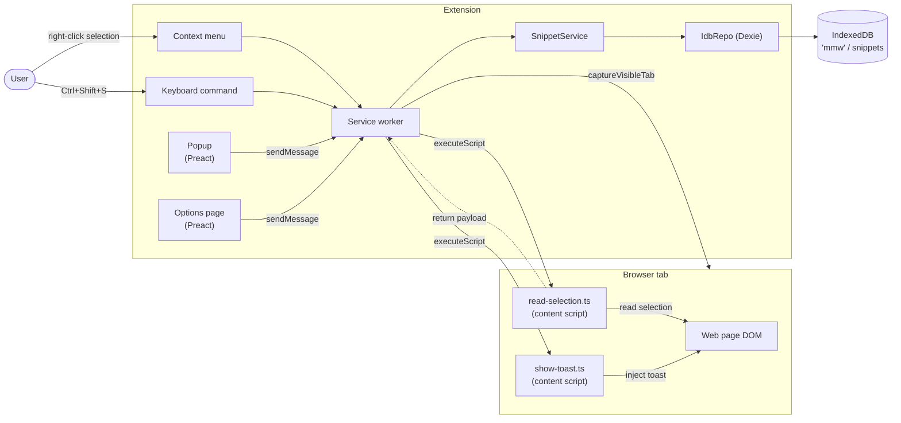
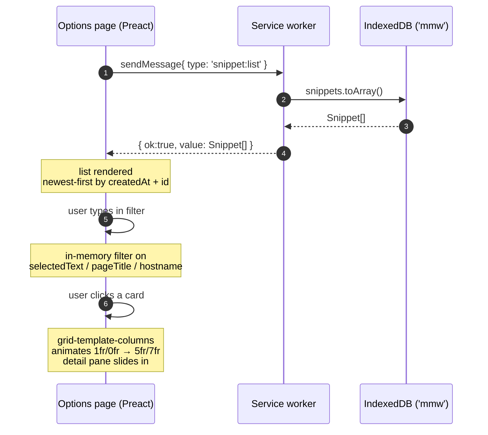
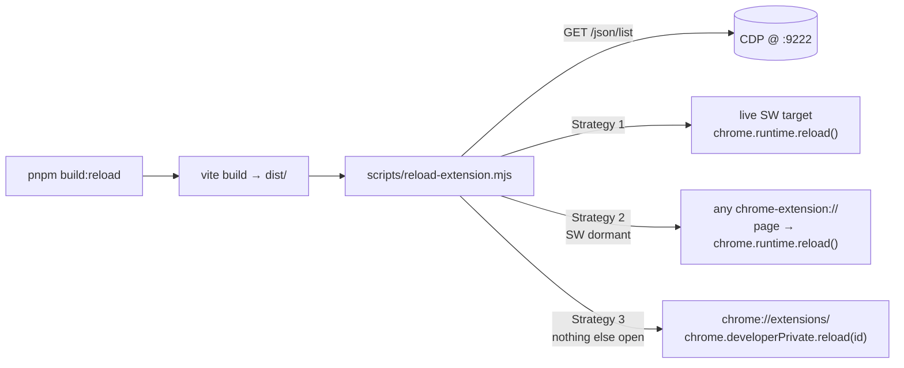

# Architecture

This document describes what `mark-my-words` is, how its parts fit
together, and how to find your way back to any piece of it.

> **Naming note (recent rename):** what older parts of this doc call
> "snippets" / "Snippet" is now expressed in code as **Records** — a
> discriminated union of **Selection** (text excerpt with context) and
> **Page** (whole-page bookmark, no body). Both share the same storage
> table and the same set of operations (note, tags, archive, etc.) —
> they only differ in what `read-*` content function captures and what
> the list/detail UI renders. See
> `workbench/dev/mark-my-words/09-records-and-pages.md` for the full
> rationale, type model, and file map.

## What it is

A Manifest V3 browser extension that captures **records** of two kinds
from the current tab — text selections (with surrounding context) and
whole pages — and stores them locally in IndexedDB. A separate options
page lets you browse, filter, and inspect saved records.

There is no account, no remote server, no sync, and no telemetry.
Everything lives in the browser profile.

## Feature set

| Feature                  | Trigger                                                             | Where it happens                |
| ------------------------ | ------------------------------------------------------------------- | ------------------------------- |
| Save selection           | Right-click → "Save selection as snippet"                           | Service worker                  |
| Save selection (alt)     | `Ctrl+Shift+S` while text is selected                               | Service worker                  |
| Save confirmation        | Toast injected into the page                                        | Content script                  |
| Page snapshot            | Captured at save time, JPEG q=70                                    | `chrome.tabs.captureVisibleTab` |
| Recent list              | Toolbar icon → popup                                                | Popup (Preact)                  |
| Browse + filter + detail | Options page (`chrome://extensions/` → Details → Extension options) | Options (Preact)                |

## High-level component diagram



The service worker is the only piece that touches IndexedDB. The popup
and options page send envelope-wrapped messages
(`{ ok, value } | { ok, error }`) and never open the DB themselves.

## Save flow

```mermaid
sequenceDiagram
  autonumber
  actor U as User
  participant Menu as Context menu / Command
  participant SW as Service worker
  participant CS1 as read-selection.ts
  participant Chrome
  participant Toast as show-toast.ts
  participant DB as IndexedDB ('mmw')

  U->>Menu: right-click → "Save selection as snippet"
  Menu->>SW: contextMenus.onClicked
  SW->>CS1: scripting.executeScript(func: readSelectionInPage)
  CS1-->>SW: { selectedText, contextBefore, contextAfter, sourceUrl, pageTitle, iframeUrl? }
  SW->>Chrome: tabs.captureVisibleTab({ format:'jpeg', quality:70 })
  Chrome-->>SW: data:image/jpeg;base64,...
  SW->>DB: snippets.put({ id: ULID, ...payload, screenshotDataUrl, createdAt })
  DB-->>SW: ok
  SW->>Toast: scripting.executeScript(func: showToastInPage, args: ['success', 'Selection saved'])
  Toast-->>U: 4-second toast on the page
```

Notes:

- The content scripts (`read-selection.ts`, `show-toast.ts`) are
  self-contained — no module imports. They are serialized via
  `Function.prototype.toString` by `chrome.scripting.executeScript`,
  so any external reference would break at runtime.
- Capture failure (e.g. on restricted pages like `chrome://`) is
  swallowed; the snippet still saves without `screenshotDataUrl`.

## Browse flow



The detail pane shows the full selection (blockquote), the in-context
view with `<mark>` highlighting, source link, page title, timestamp,
and the screenshot when one exists.

## Storage

One IndexedDB database, one object store.

| Item          | Value                    |
| ------------- | ------------------------ |
| Database name | `mmw`                    |
| Object store  | `snippets`               |
| Primary key   | `id` (ULID)              |
| Indexes       | `createdAt`, `sourceUrl` |

The schema is created and managed by Dexie in
`src/storage/idb-repo.ts`. Other fields (`selectedText`, context,
`pageTitle`, `screenshotDataUrl`, etc.) are stored unindexed.

`Snippet` shape lives in `src/shared/types.ts`. Every snippet has:

- `id` (ULID, sortable by creation time)
- `selectedText`, `contextBefore`, `contextAfter`
- `sourceUrl`, optional `iframeUrl`, `pageTitle`
- optional `screenshotDataUrl` (JPEG data URL)
- `createdAt`, `updatedAt` (ISO 8601)
- optional `note` (reserved; not yet writable)

Capacity is the browser's IDB origin quota — typically a meaningful
chunk of free disk, not the 10 MB cap that `chrome.storage.local`
imposed before the migration.

## Message protocol

Pages talk to the service worker via `chrome.runtime.sendMessage`,
which doesn't propagate Promise rejections. Every reply is wrapped:

```ts
type Response<T> = { ok: true; value: T } | { ok: false; error: string };
```

Senders use `src/shared/send.ts` which unwraps the envelope and turns
`ok:false` into a thrown `Error`. Message types are pure types in
`src/shared/messages.ts` (no browser imports — keeps test envs clean).

Current messages:

| Type            | Returns     |
| --------------- | ----------- |
| `snippet:save`  | `Snippet`   |
| `snippet:list`  | `Snippet[]` |
| `snippet:count` | `number`    |

## File map

```
src/
├── manifest.ts              MV3 manifest as TypeScript (built into manifest.json)
├── config.ts                Tunables (TOAST_VISIBLE_MS, …)
├── background/
│   └── service-worker.ts    Context menu + command + message dispatcher;
│                            orchestrates save: read → capture → persist → toast
├── content/
│   ├── read-selection.ts    Self-contained selection reader (no imports)
│   └── show-toast.ts        Self-contained toast injector
├── popup/
│   ├── popup.html
│   ├── popup.tsx            Recent snippets — minimal list
│   ├── snippet-list.tsx
│   └── styles.ts
├── options/
│   ├── options.html
│   ├── options.css          Just `@import "tailwindcss";`
│   └── options.tsx          List + filter + detail pane (with animation)
├── shared/
│   ├── types.ts             Snippet, SnippetInput, SnippetEdit
│   ├── messages.ts          Message types + isMessage guard
│   ├── send.ts              chrome.runtime.sendMessage wrapper
│   └── dispatcher.ts        Service-worker side message handler
├── snippets/
│   └── snippet-service.ts   Domain layer: id, timestamps, sort, paginate
├── storage/
│   ├── repository.ts        Repository<T> interface
│   └── idb-repo.ts          Dexie implementation
└── lib/
    ├── time.ts              nowIso, formatRelative (Intl.RelativeTimeFormat)
    └── ulid.ts              ULID factory
```

Tests:

```
src/**/*.test.ts             Vitest units (happy-dom + fake-indexeddb)
e2e/
├── fixtures.ts              Persistent context loads dist/, exposes extensionId
├── seed.ts                  Raw-IDB seeding helpers + makeSnippet factory
├── options-smoke.spec.ts    Empty-state smoke
└── options-list.spec.ts     5 specs: list, filter, detail open, close, screenshot
```

## Build and reload workflow

`pnpm build` writes `dist/`. The running extension caches the SW in
memory and won't pick up changes until reloaded.
`pnpm build:reload` rebuilds and reloads the extension in the
test browser via CDP at port 9222.



Strategies are tried in order. Strategy 3 (added after the SW kept
going dormant during long pauses) requires developer mode to be
enabled on the profile — which `launch.sh` now seeds into the
profile's `Preferences` file before Chromium starts so the user
doesn't have to toggle it manually.

## Testing

| Layer | Tool       | Files              | Approx. count      |
| ----- | ---------- | ------------------ | ------------------ |
| Unit  | Vitest     | `src/**/*.test.ts` | 68 tests / 9 files |
| E2E   | Playwright | `e2e/*.spec.ts`    | 6 tests / 2 files  |

Coverage: vitest with the istanbul provider; thresholds 80/80/75/80
in `vitest.config.ts`. `.tsx` files are excluded from coverage —
they're tested through Playwright.

The Playwright fixture launches a persistent context with
`--load-extension=dist/` and discovers the extension ID from the
service worker URL. Specs seed `IndexedDB` directly via raw IDB
inside `page.evaluate` — no real screenshot capture needed; we
inject a tiny PNG data URL when we want to assert the image renders.

`pnpm e2e:build` runs `vite build` first; `pnpm e2e` skips the build
and just runs Playwright against whatever is already in `dist/`.

## Gotchas worth remembering

1. **Content scripts are stringified.** Any `import` in
   `read-selection.ts` or `show-toast.ts` will throw at runtime
   because `chrome.scripting.executeScript({ func })` serializes the
   function and re-evaluates it in the page. Keep them self-contained.

2. **Envelope-wrapped messages.** Don't return raw promises from the
   dispatcher — `chrome.runtime.sendMessage` doesn't surface
   rejections. The dispatcher converts thrown errors into
   `{ ok:false, error }` and `send.ts` turns those back into rejects.

3. **`exactOptionalPropertyTypes` is on.** Don't pass
   `screenshotDataUrl: undefined` — use a conditional spread:
   `{ ...result, ...(screenshotDataUrl !== undefined && { screenshotDataUrl }) }`.

4. **Build doesn't reach the running extension** until you reload
   it. Use `pnpm build:reload`. If it can't find a CDP target,
   either the test browser is down or you need at least one of:
   live SW, an extension page open, or `chrome://extensions/` open.

5. **Developer mode must be on** for unpacked extensions to actually
   run. `launch.sh` seeds the pref into the profile, but if you
   `chrome://extensions` manually disabled it, things stop working.

6. **MV3 service workers go dormant** after ~30 s idle. CDP's
   `/json/list` doesn't include dormant SWs, which is why the
   reload script has fallback strategies.

7. **Extension ID changes** when the extension is loaded into a new
   profile (no `key` in the manifest). Tests discover the ID from
   the SW URL rather than hard-coding it.
